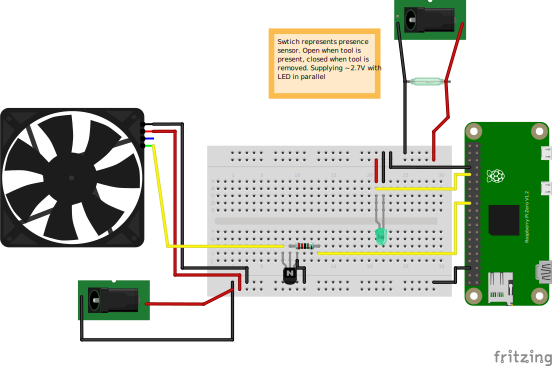

# Fume Hood - Automatic Solder Fume extraction

The [Aixun T3A][1] has a dormancy feature based on tool presence in the holder.
By interfacing with the tool presence system, this code and described circuit
drive a [Noctua PWM fan][2]. This requires the [optional upgrade stand][4].

## Usage

### The "Target"

This code was written for the Raspberry Pi. The installation script `install.sh`
expects that it will have password-less sudo access and that `TARGET` is
accessible via SSH key. Python >=3.7, <4.0.

You will also need to start and enable `pigpiod`:

```bash
$ sudo apt install -y pigpio
$ sudo systemctl enable pigpio
```

### Installation

To install the service onto the `TARGET`, run the following:

```bash
$ sh install.sh <TARGET>
```

### Other Usage

The service can be manged via `systemctl`:

```bash
$ sudo systemctl [start|stop|restart|...] fume-hood
```

By default the iron dormancy signal should go to pin 8 and the fan is controlled
via pin 12. Either of these can be changed by via:

```bash
$ fume-hood -t <TOOL_PIN> -f <FAN_PIN>
```

The fan will given a signal with 50% duty cycle by default, this can be changed
with the following option:

```bash
$ fume-hood -s <DUTY_CYCLE> # Must by 0-100
```

## Circuits



### Dormancy Detection

The [Aixun T3A][1] has a dormancy function which puts the heater to sleep while
the soldering iron is docked. The unit has an adjustable dock whose mounting
bolts provide a conductive interface to the base to transmit the signal back to
the controller. Adding a 30AWG pick up wire to the mounting bolt by wrapping it
around the bolt and screwing it into the unit. A common ground can be accessed
via the ground port (item 21 [here][3]) on the back of the controller.

The LED is in parallel to provide visual feedback and provide a bit of
resistance. With no load, I was seeing voltage spikes of 4+ volts. With the LED
it stays around 2.7 volts.

### PWM Fan Control

[1]:
  https://aixuntech.com/product/t3a-temperature-controlled-quick-soldering-station-with-t12-936-handle/
[2]:
  https://noctua.at/pub/media/wysiwyg/Noctua_PWM_specifications_white_paper.pdf
[3]: https://aixuntech.com/userimages/2022-10/1666693451.jpg
[4]: https://aixuntech.com/userimages/2022-10/1666693528.jpg
